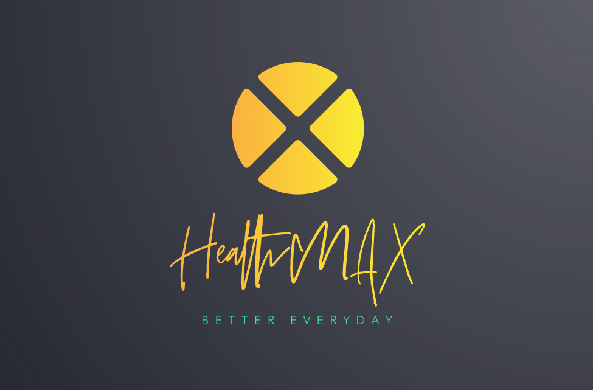

## HealthMAX

  
Table of Contents

  <ol>
    <li>
      <a href="#about-the-project">About the Project</a>
      <ul>
        <li><a href="#goals">Goals</a></li>
        <li><a href="#target-audience">Target audience</a></li>
        <li><a href="#built-with">Built With</a></li>
      </ul>
    </li>
    <li><a href="#ui-and-ux">UI and UX</a></li>
    <li><a href="#features">Features</a></li>
  </ol>

## About the Project
As Singaporean become more and more health-conscious. The number of people wanting to be more active have been increasing over the years, especially after the COVID-19 pandamic (2020). Thus this concept of a Gym & Studio finder application was birthed to help assist both veterans and new gym-goers. 

This application will benefit new gym-goers by showing them the near-by Gym & Studio with the reviews by actual public. On top of that it shows the food center near the selected gym and the weather. For the vetarans it also provide them with a health tracker system for better self-accessment.

The demo of the live website can be accessed here:
[HealthMax](https://ericerchinann.github.io/project_01/)

(<a href="#healthmax"> Back to top </a>)

## Goals
Mental and physical health have become more of an issue of importance, one of the few contermeasures are being physically active and joining communities. 

Our target audience seek a community to stay active and self-improvement. More often then not is it hard take the first step in the search. Our organization's goals are to help ease and assist users to find a suitable community and encourage community growth and empowerment. 

(<a href="#healthmax"> Back to top </a>)

## Target audience
Our target audience are people age between 21 to 50, which can be further broken down into 3 groups :
* *Bronze Age* ( 21 - 30 )
*  *Silver Age* ( 31 - 40 )
* *Golden Age* ( 41 - 50 )

We are also targeting both **veterans** and **new gym-goers** alike. To help user obtain a healthier lifestyle. 

(<a href="#healthmax"> Back to top </a>)

## UI and UX
The aim of the this application is to create a simple and easy to use and understand layout.

On the landing page, the user will be greeted with motivational quote before proceeding to the map.

## Features

- [x] Search
    * User can interact with text input and the dropdown list for define their search. 
    * Search results of nearby Gym & Studio within 10km radius and display markers for each.
    * Show image and reviews (if any) about selected marker as a popup. 
  

- [x] Food Search
    * Search for food center within a 500m radius (shown on map) of the selected location.
    * Display map markers of food center found.
    * Popup to display infomation and image of food center
  

- [x] Weather Display
    * Display a 2 hourly real-time track of the current weather of a location.
    * Weather will be accurate within a 3km radius (shown on map).
  

- [x] Personal Health Tracking
    * User can login or create a new account to have a more personalized experience.
    * Training schedule can be track to provide better pre-workout planning.
    * A easy to understand visual display using charts.
  

- [ ] Auto Pathing 
    * Show user the way to get to the location they want
    * Choice of transportation eg. Walking, Public Transport or Personal Vehicles
  
    
- [ ] GPS Location Tracking
    * Allow user to use their own location 
    * Provide a more accurate search and pathing results
  

(<a href="#healthmax"> Back to top </a>)

## Built With
* Visual Studio Code (html,css,js files)
    - A free and easy to use coding programme for beginners

* Leaflet
    - Well written documentation and multiple videos tutorials regarding the use of their map add-ons

* Bootstrap
    - Designed to enable responsive development of mobile-first websites

* Animate.CSS
    - Easy way to make web pages more dynamic and engaging

* ApexCharts
    - Enable creation beautiful and interactive visualizations of data

* CLIP STUDIO PAINT
    - Selections of varying feature create by the software and users

(<a href="#healthmax"> Back to top </a>)
