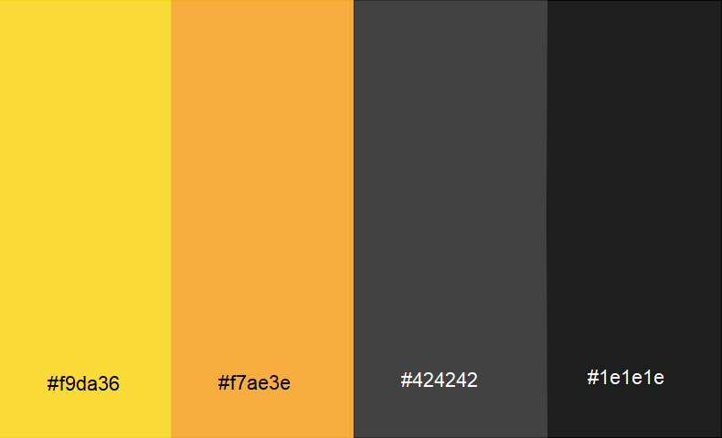

# HealthMAX
  
Table of Contents

  <ol>
    <li>
      <a href="#about-the-project">About the Project</a>
      <ul>
        <li><a href="#goals">Goals</a></li>
        <li><a href="#target-audience">Target audience</a></li>
      </ul>
    </li>
    <li>
    <a href="#ui-and-ux">UI and UX</a>
    <ul>
        <li><a href="#design">Design</a></li>
        <li><a href="#wireframe">Wireframe</a></li>
    </ul>
    </li>
        <li>
        <a href="#features">Features</a>
        <ul>
        <li><a href="#wireframe">Wireframe</a></li>
        <li><a href="#limitations">Limitations</a></li>
        </ul>
        </li>
        <li><a href="#built-with">Built With</a></li>
        <li><a href="#testing">Testing</a></li>
        <li><a href="#credits">Credits</a></li>
  </ol>

## About the Project
As Singaporean become more and more health-conscious. The number of people wanting to be more active have been increasing over the years, especially after the COVID-19 pandamic (2020). Thus this concept of a Gym & Studio finder application was birthed to help assist both veterans and new gym-goers. 

This application will benefit new gym-goers by showing them the near-by Gym & Studio with the reviews by actual public. On top of that it shows the food centre near the selected gym and the weather. For the vetarans it also provide them with a health tracker system for better self-accessment.

The demo of the live website can be accessed here:
[HealthMax](https://ericerchinann.github.io/project_01/)

(<a href="#healthmax"> Back to top </a>)

## Goals 
### Organization's goals
 Mental and physical health have become more of an issue of importance, one of the few contermeasures are being physically active and joining communities. Our organization's goals are to help ease and assist users to find a suitable active community and encourage community growth and empowerment. 
### User's goals
Our target audience seek a community to stay active and self-improvement. More often then not is it hard take the first step in the search.

Below are some user stories:
| User Stories | Accceptance Criteria |
| ----------- | ----------- |
| A new gym-goer want to find a Gym or Studio near-by their workplace or home | User can search in a location on the map and result will be shown based on given location up to 10km|
| Veterans want to try out a different workout activity that they might not have tried or known| A dropdown list is avaliable for user to further narrow down their search to a type of Gym or Studio eg. Climbing Gym, Boxing Gym, etc.|
| After a workout, user often feels hungry and wish to find a near-by food centre.| Application allow user to locate near-by food centre within a 500m radius around the selected gym.|
| User want to know the weather in a selected location| Weather can be track real time on a 2 hourly update with accuracy within a 3km radius|

(<a href="#healthmax"> Back to top </a>)

## Target audience
Our target audience are people age between 21 to 50, which can be further broken down into 3 groups :
* *Bronze Age* ( 21 - 30 )
*  *Silver Age* ( 31 - 40 )
* *Golden Age* ( 41 - 50 )

We are also targeting both **veterans** and **new gym-goers** alike. To help user obtain a healthier lifestyle. 

(<a href="#healthmax"> Back to top </a>)

## UI and UX
The aim of the this application is to create a simple and easy to use and understand layout. Forming a theme and developing a wireframe.

## Design
### Colors

| Color Hex | Feeling it give off |
| ----------- | ----------- |
| #f9da36 ( Yellow ) | Excitement, Enthusiasm, Confidence |
| #f7ae3e ( Orange )| Happy, Motivated, Uplifting |
| #424242 ( Grey )| Neutrality, Balance, Solid, Stable |
| #1e1e1e ( Black )| Sophisticate, Professionalism, Powerful, Luxury, Elegance |

We decided to use an gradient of yellow and orange, grey and black. Not only do they make otherwise flat and solid colors more vibrant and exciting to look at, but they're useful for focusing attention, improving engagement and modern feel to it.

(<a href="#healthmax"> Back to top </a>)

## Wireframe

The deployed site have gone through multiple iterations and improvements. Many changes have been made compared to the alpha version of the application. 

### Changes
1. Application have unified theme
2. There is a different landing page
3. Login page have been changed from a page to small offcanvas
4. Added a dropdown list to narrow down the search result
5. Added 2 buttons to the search bar for additional service of the application

(<a href="#healthmax"> Back to top </a>)

## Features

On the landing page, the user will be greeted with randomly generated motivational quote before proceeding to the map. There will also be a loading bar for user's with slower internet ( Shown above on the tablet device )

| Features | Status | Description |
| --- | --- | ---- |
| Search | DONE | User can interact with text input and the dropdown list for define their search. Results of nearby Gym & Studio within 10km radius will display as markers on the map. Show image and reviews (if any) about selected marker as a popup.|
| Food Centre Locator | DONE | Search for food centre within a 500m radius (shown on map) of the selected location as map markers. Map popup to display infomation and image of food centre |
| Weather Display | DONE | Display a 2 hourly real-time track of the current weather of a location with and accuracy within a 3km radius (shown on map) |
| Personal Health Tracking | WIP | User can login or create a new account to have a more personalized experience. Training schedule can be track to provide better pre-workout planning. A easy to understand visual display using charts. |
| Auto Pathing | NOT IMPLEMENTED | Show user the way to get to the location they want using their preferred choice of transportation eg. Walking, Public Transport or Personal Vehicles |
| GPS Location Tracking | NOT IMPLEMENTED | Allow user to use their own location to provide a more accurate search and pathing results |

(<a href="#healthmax"> Back to top </a>)

## Limitations
1. Collection of private data
    * To personalized health tracking, private data will be collected. Without a back-end such collection of data will be prone to leaks
  

2. Editing the accounts details 
    * Being a front-end only web application, there is not back-end database so store the informations
  

3. Allow Auto Pathing
    * Due to time limitation, this was not implemented.
    * However user can change how the map look to allow a more navigatable and infomative map to assist in transit be it by public transport or by personal vehicles

(<a href="#healthmax"> Back to top </a>)

## Built With
* [Visual Studio Code](https://code.visualstudio.com/) ( HTML, CSS, Javascript )
    - A free and easy to use coding programme for beginners
  

* [Leaflet](https://leafletjs.com/)
    - Well written documentation and multiple videos tutorials regarding the use of their map add-ons
  

* [Axios](https://axios-http.com/docs/intro)
    - Ability to intercept HTTP requests. 
  

* API Used
    - [FourSquare](https://location.foursquare.com/developer/)
    - [OpenWeather](https://openweathermap.org/)
  

* [Bootstrap 5](https://getbootstrap.com/)
    - Designed to enable responsive development of mobile-first websites
  

* [Animate.CSS](https://animate.style/)
    - Easy way to make web pages more dynamic and engaging
  

* [ApexCharts](https://apexcharts.com/)
    - Enable creation beautiful and interactive visualizations of data
  

* [CLIP STUDIO PAINT](https://www.clipstudio.net/)
    - Selections of varying feature create by the software and users
  

(<a href="#healthmax"> Back to top </a>)

## Testing
### Test Account
* username: admin1
* paswword: admin123
  

* username: admin2
* paswword: admin234
  

Show Test Cases

|Test Case|Steps|Results|
|---|---|---|
|Loading of Webpage|<ol><li>Go to [HealthMax](https://ericerchinann.github.io/project_01/)</li></ol>|<ol><li>The website should load without issue</li><li>For slower internet user, A loading bar will appear while it loads</li></ol>|
|Go to Map page|<ol><li>Land on the website landing page</li><li>Wait for loading bar ( if any ) to complete</li><li>Click anywhere when the motivational quote appear</li></ol>|<ol><li>Landing page will show a loading bar if map is still loading</li><li>When map is done loading, the loading bar will disappear and a motivational quote will appear</li><li>Clicking anywhere the page will collapse to reveal the map</li></ol>|
|Changing Map layout|<ol><li>While on the map page, mouse over to the bottom right layer icon</li><li>Select one of the radio button to change the layout</li></ol>|<ol><li>Mousing over will change the icon to a selection of radio buttons</li><li>Clicking on any of the radio button will instantly change to look of the map</li></ol>|
|Search for Gym and Studio|<ol><li>Enter a query in the text input ( Optional )</li><li>Select a type of Gym or Studio ( Optional )( Default will show all type of Gym and Studio )</li><li>Click the search button</li></ol>|<ol><li>Unique markers will appear on the map</li><li>Search results will appear on top left</li></ol>|
|Validation of Gym and Studio search|<ol><li>Move the visual location to the ocean</li><li>Click the Search Button</li></ol>|<ol><li>An alert will appear displaying an error warning</li></ol>|
|Show details of selected Map Marker|<ol><li>After the search, click on the name of Gym and Studio on the search result list</li><li>Wait for the transition</li></ol>|<ol><li>The search result list will collapse</li><li>The map will transit to the selected Gym and Studio and zoom in</li><li>A popup will appear showing the name, address, a image and a review ( If Any )</li></ol>|
|Toggling display food centre within a 500m radius|<ol><li>Click the 🍜 icon button</li><li>Click again to toggle display</li></ol>|<ol><li>Clicking it will display the radius, the center and the food markers within the radius</li><li>The button will be highlighted to indicate the toggle is on</li><li>Clicking it again wil remove the radius, the center and the food markers. The button will not be highlighted to indicate the toggle is off</li></ol>|
|Toggling display of Weather|<ol><li>Click the ⛅ icon button</li><li>Click again to toggle the display</li></ol>|<ol><li>Will display a 3km radius and a weather marker</li><li>The weather result will be displays on the top left with tempertature</li><li>Clicking it again will remove the marker and radius. Text display on the top left will disappear</li></ol>|
|Login to an exsisting account|<ol><li>Click on the login on the bottom left</li><li>Type in the account infomations</li><li>Click the login button on the form</li></ol>|<ol><li>A form will appear after clicking the login</li><li>Clicking login after inputting the account info will display account infomation</li><li>Bottom left login button will change to user's name</li></ol>|
|Create a new account|<ol><li>Click the login button on the bottom left</li><li>Click the create account button on the form</li><li>Input infomations that is needed</li><li>Click the submit button</li></ol>|<ol><li>A form will display</li><li>After step 2 the login form will change into account create form</li><li>After submitting account create form will change into account form</li><li>Login button on the bottom left will change into user's name</li></ol>|
|Logging out|<ol><li>Click the name on the bottom left</li><li>click the log out button</li></ol>|<ol><li>Account infomation will appear</li><li>After click logout, the account form will change into login form</li><li>Button on the bottom left will change from user's name into Login</li></ol>|
|Account Login and Creatation validation|<ol><li>Enter the required information on the login form or the account create form incorrectly or leaving it empty</li><li>Click the submit or login button on the form</li></ol>|<ol><li>Error message will appear informing the user of the required information</li></ol>|

(<a href="#healthmax"> Back to top </a>)

## Credits
### Logo and Art
* By Eric Er Chin Ann using [CLIP STUDIO PAINT](https://www.clipstudio.net/)
  

### Map Marker
* By juicy_fish posted on [flaticon](https://www.flaticon.com/packs/location-pins-22)
  

### Different Device Display Demo
* [CreateMockUp](https://www.createmockup.com/generate/)

(<a href="#healthmax"> Back to top </a>)
